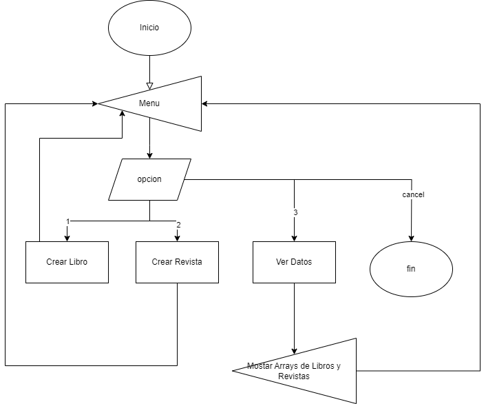
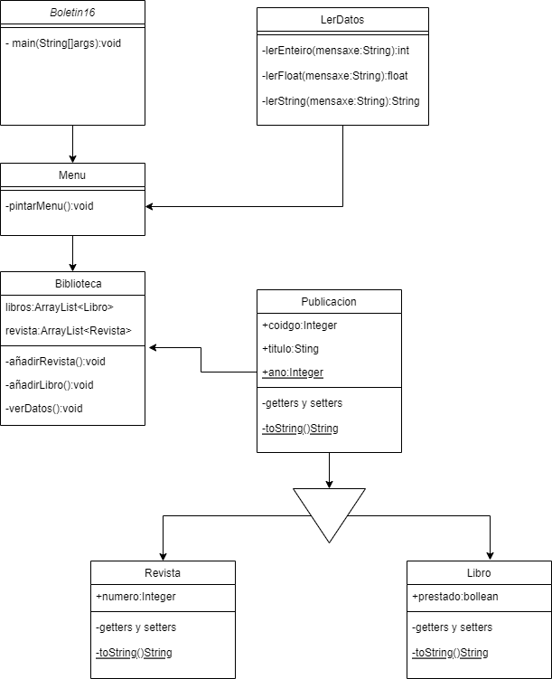

# Tarea de Seguimiento

Este repositorio contiene el seguimiento de una tarea específica, detallada a continuación.

## Pasos a seguir:

### 1. Diagrama de Flujo
   - Adjunte el diagrama de flujo correspondiente a esta tarea aquí:
     

### 2. Diagrama de Clases
   - Adjunte el diagrama de clases correspondiente a esta tarea aquí:
     

### 3. Crear el archivo JAR
   - Para esto, he seguido los pasos a través del IDE

### 4. Etiquete el commit usando el comando `git tag -a v1.0 -m"`

### 5. Realizo una modificación y creo una nueva release de una nueva etiqueta y hago un rebuild
   - Realicé la siguiente secuencia de pasos:
     1. Realicé modificaciones necesarias.
     2. Creé una nueva etiqueta utilizando `git tag -a v2.0 -m"`[Mensaje descriptivo]"`.
     3. Creé una nueva release asociada a la nueva etiqueta.
     4. Realicé un rebuild del proyecto para reflejar los cambios.

